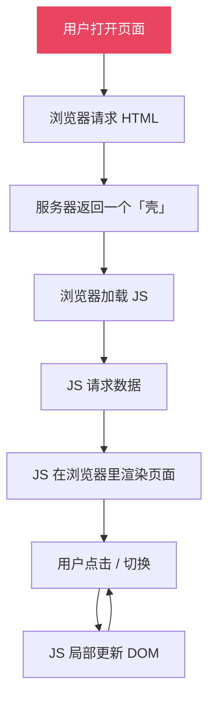
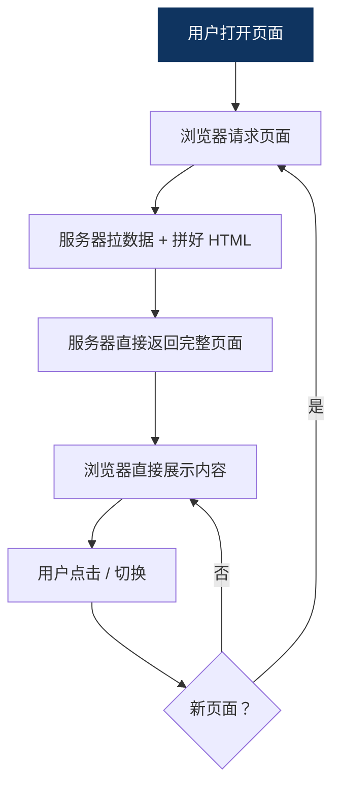
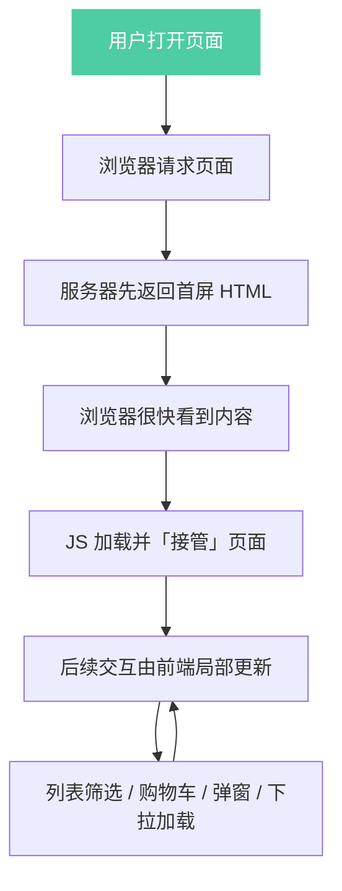

# 01 - SPA 基础练习

## 目标

理解单页应用为什么能比传统多页应用更适合复杂前端项目。

## 先分清两个概念

这章里你会同时看到两种页面组织方式：

- **传统多页应用（MPA）**：每次点击链接，浏览器通常会进入一个新的 HTML 页面，页面整体重新加载。
- **单页应用（SPA）**：先加载一个应用壳，之后的切换主要靠 JavaScript 在当前页面里局部更新。

你可以把它们理解成两种完全不同的“页面切换方式”。

### 差距在哪里

| 维度 | 传统多页（MPA） | SPA |
|---|---|---|
| 页面结构 | 每个页面都是独立 HTML | 通常只有一个入口壳 |
| 跳转方式 | 浏览器重新请求新页面 | 前端自己切换视图 |
| 页面刷新 | 会整页刷新 | 通常不整页刷新 |
| 内容更新 | 往往替换整个页面 | 主要更新局部区域 |
| URL 体验 | 每个页面对应一个地址 | 可以用 `#` 或 history 路由 |
| 复杂交互 | 可做，但页面间状态切换更重 | 更适合大量交互和状态变化 |

### 什么时候适合用什么

- 适合 **传统多页** 的场景：
  - 官网、文档站、内容站
  - 页面数量不多，但每个页面都比较独立
  - 更看重首屏直出、SEO、简单稳定
- 适合 **SPA** 的场景：
  - 管理后台、控制台、仪表盘
  - 交互很多、状态变化频繁
  - 同一个壳里要切很多业务视图

### 典型业务场景怎么选

- **企业官网 / 品牌展示站**
  - 通常更偏传统多页、静态站或 SSR
  - 页面内容相对固定，重点是展示和收录
  - 交互不多，性能和 SEO 更重要
- **电商网站**
  - 通常是混合方案，不是纯传统多页，也不是纯 SPA
  - 商品详情、首页、类目页常偏 SSR / SSG / 混合渲染
  - 购物车、订单、个人中心、后台管理更偏 SPA
- **管理后台 / 运营控制台**
  - 通常更偏 SPA
  - 因为切换频繁、表格和表单多、状态变化多
  - 用户通常更关注操作效率，而不是 SEO

### 生产环境里常见的 SPA 方式

真实项目里的 SPA，通常不只是“按钮改一段文字”，而是：

- 顶部导航和侧边栏固定
- 中间区域根据路由切换内容
- 需要数据请求、加载中、错误态
- 会同步修改 `document.title`
- 经常配合 `hash` 路由或 `history` 路由

你之前提到的地址栏里带 `#`，就是 **hash 路由** 的典型表现。  
为了看清楚它在干什么，可以先把它拆开：

| 部分 | 例子 | 含义 |
|---|---|---|
| 页面主体 | `https://example.com/app` | 真正的页面地址 |
| hash 部分 | `#/orders` | 前端自己读的路由标记 |
| 完整地址 | `https://example.com/app#/orders` | 浏览器看到的最终 URL |

hash 路由的作用是：

- URL 会变化
- 但不会整页刷新
- 前端根据 `location.hash` 决定显示哪个视图

它的特点可以拆成两句：

- `#` 右边的内容会被前端拿来判断页面状态
- `#` 本身不会让浏览器去服务器重新请求一个新页面

所以它很适合做 SPA 入门示例，也很适合做一些不想整页刷新的站内切换。

### 三种渲染方式流程图

### 你可以这样理解混合方案

混合方案里，通常不是“一次请求把所有页面都返回回来”，而是：

- 首屏内容先由服务端渲染好
- 浏览器一打开就先看到主要内容
- 后续的列表筛选、购物车、弹窗、加载更多，再由前端 JS 接管

更准确地说：

> 首屏先用 SSR 保证速度和可见性，后续交互再由前端做局部更新。

所以你那句理解可以改成：

> 首屏会先由服务端渲染出关键 HTML。用户先看到第一屏内容；等页面加载完成后，后续区域再交给前端继续渲染和更新。

### 你可以怎么记这个工作方式

你刚才的理解可以整理成一句更准确的话：

> 用户点击按钮、切换标签、滚动到某个区域、或者网络请求返回结果之后，都会触发 JavaScript。  
> JavaScript 再根据当前状态去更新局部 DOM，所以页面看起来像只变了一部分。

这里的关键不是“点了就自动改”，而是：

- 先有一个事件
- 事件触发 JS
- JS 计算新状态
- JS 修改 DOM
- 浏览器把变化渲染到屏幕上

所以 SPA 不是“不会加载动态内容”，而是“动态内容就是由 JS 主动控制渲染出来的”。

## 练习任务

1. 用自己的话写出“传统多页”和“SPA”的区别。
2. 画一张简图，说明首次加载和后续交互的差异。
3. 打开练习场里的传统多页示例，观察地址栏和页面内容怎么变化。
4. 打开练习场里的 SPA 示例，观察 `#/...`、标题和内容区是怎么联动的。
5. 写一个最小页面，页面中只有一个按钮和一块内容区域。
6. 点击按钮时，只更新内容区域，不刷新整页。
7. 选一个你熟悉的网站，说出它更像传统多页、SPA，还是混合方案。

## 检查点

- 我是否能说明“首次加载”和“后续交互”分别发生了什么
- 我是否能说清楚为什么 SPA 更适合大量交互
- 我是否能说明什么时候适合传统多页，什么时候适合 SPA
- 我是否能解释 `#` 路由在 SPA 里起什么作用
- 我是否能说明一个用户动作是如何触发 JS，再由 JS 改 DOM 的

## 记录区

- 我做到了：
- 我卡住了：
- 下一步：
